# Feria del Empleo UCB

## Table of Contents

- [Introduction](#introduction)
- [Technologies Used](#technologies-used)
- [Features](#features)
  - [For Students](#for-students)
  - [For Administrators](#for-administrators)
- [Screenshots](#screenshots)
  - [Home Page](#home-page)
  - [View All Institutions](#view-all-institutions)
  - [View Institution Details](#view-institution-details)
  - [Calendar with Monthly View of Talks from Many Institutions](#calendar-with-monthly-view-of-talks-from-many-institutions)
  - [Student View to Access a Charla Link from the Calendar](#student-view-to-access-a-charla-link-from-the-calendar)
  - [Admin Login](#admin-login)
  - [Registration of an Admin User](#registration-of-an-admin-user)
  - [List of All Institutions](#list-of-all-institutions)
  - [Create an Institution](#create-an-institution)
  - [Uploading Images to Firebase with Drag and Drop](#uploading-images-to-firebase-with-drag-and-drop)
  - [Uploading YouTube Links to an Institution](#uploading-youtube-links-to-an-institution)
  - [Uploading Social Networks from the Institution](#uploading-social-networks-from-the-institution)
  - [Create a New Charla for an Institution](#create-a-new-charla-for-an-institution)
  - [Students Interested in Charlas](#students-interested-in-charlas)
- [Installation and Setup](#installation-and-setup)
  - [Database Setup](#database-setup)
  - [Backend Setup](#backend-setup)
  - [Frontend Setup](#frontend-setup)
- [License](#license)

## Introduction

The Feria del Empleo UCB project is designed to support students at Universidad Católica Boliviana (UCB) in their transition from university to the workforce by connecting them with potential employers through a virtual job fair platform. The platform allows institutions to present themselves and interact with students via video content, social media links, and Zoom meetings.

## Technologies Used

- **Frontend:** Vue.js with Vuetify for styling
- **Backend:** Express.js
- **Database:** MySQL

## Features

### For Students

- **View Institutions:** Students can browse all participating institutions organized by sectors.
- **Institution Details:** Students can view detailed information about each institution, including videos, social media links, and other relevant information.
- **Zoom Meeting Registration:** Students can register for Zoom meetings hosted by institutions, subject to availability and capacity limits.
- **Event Calendar:** Students can view a calendar of scheduled events and Zoom meeting links.

### For Administrators

- **Manage Institutions:** Administrators can create and manage institution profiles, including descriptions, videos, images (with drag and drop), and social media links.
- **Manage Events:** Administrators can create and schedule Zoom meetings, set capacity limits, and manage event details.

## Screenshots

### Home Page

The main page of the application where users can navigate to different sections.

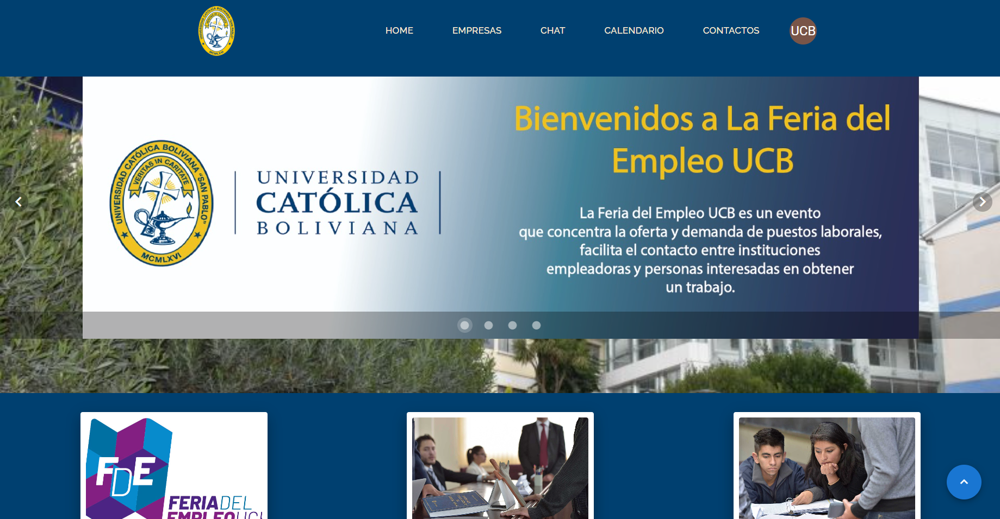

### View All Institutions

This screenshot shows the list of all institutions organized by sectors. Students can easily browse and find institutions relevant to their field of interest.

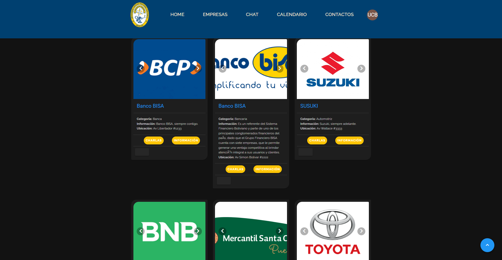
_Screenshot showing the list of all institutions organized by sectors._

### View Institution Details

This screenshot displays the detailed view of an institution. It includes information such as videos, social media links, and additional details about the institution, helping students to learn more about potential employers.

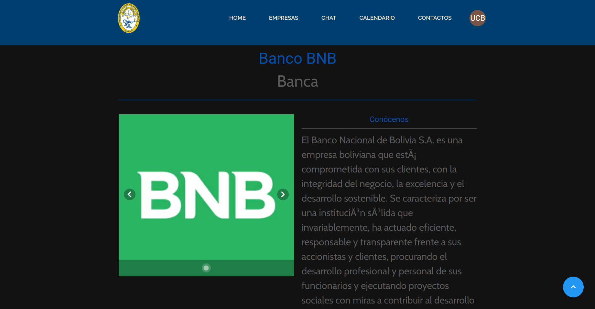
_Screenshot showing the detailed view of an institution, including videos, social media links, and additional information._

### Calendar with Monthly View of Talks from Many Institutions

The calendar provides a monthly view of all scheduled charlas. Students can see upcoming events and plan accordingly.

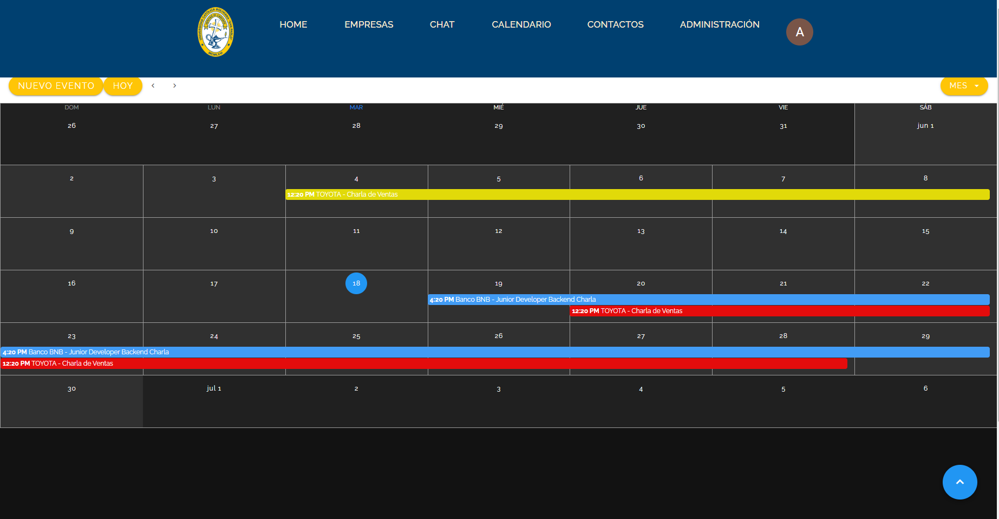
_Screenshot showing the calendar view with scheduled events and Zoom meeting links._

### Student View to Access a Charla Link from the Calendar

Students can click on a charla from the calendar view to get more details and access the meeting link. This ensures they have all the information needed to attend.

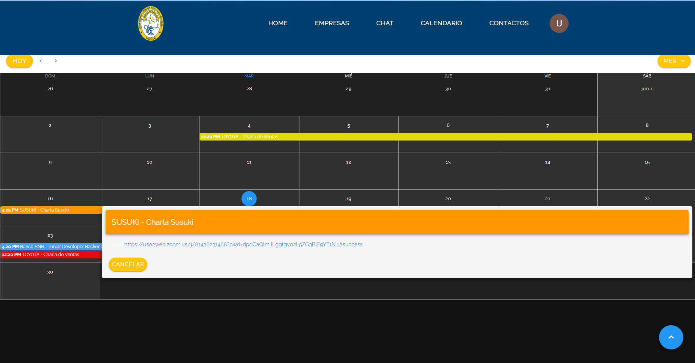
_Screenshot showing the student view for accessing charla details and Zoom links._

### Admin Login

This screen allows users to log in using their university credentials. Only students and administrators from UCB can access the system.

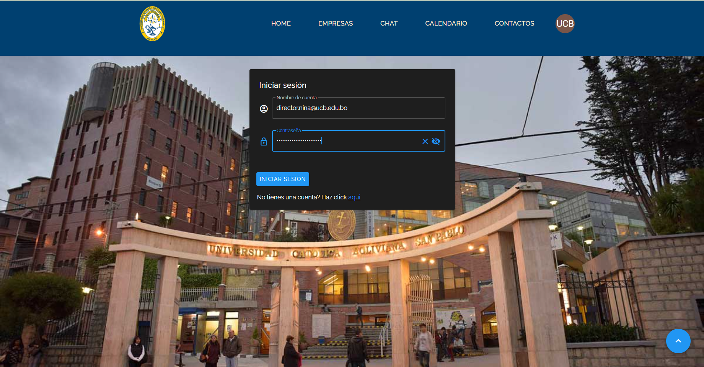
_Screenshot showing the admin login page._

### Registration of an Admin User

Administrators can create new admin accounts from this registration page. This ensures that only authorized personnel can manage the system.

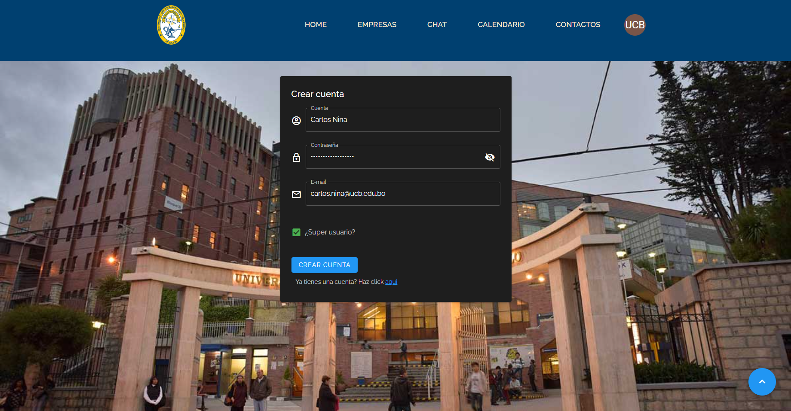
_Screenshot showing the admin user registration page._

### List of All Institutions

This page lists all registered institutions. Students can browse through these institutions to learn more about potential employers and their offerings.

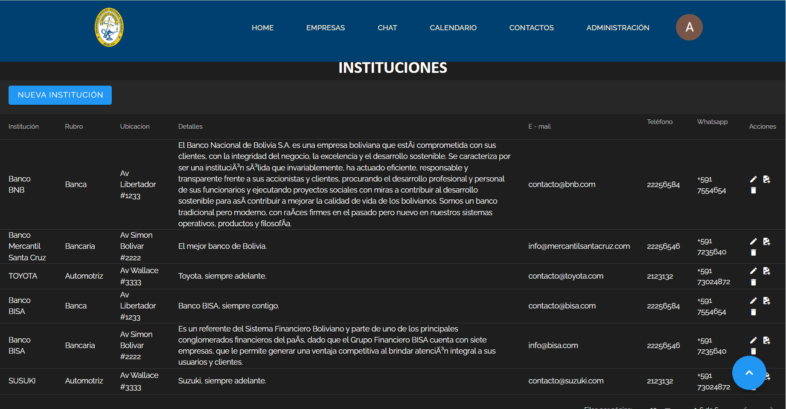
_Screenshot showing the list of all registered institutions._

### Create an Institution

Administrators can use this form to add new institutions to the system. The form includes fields for the institution's name, contact information, and a brief description.

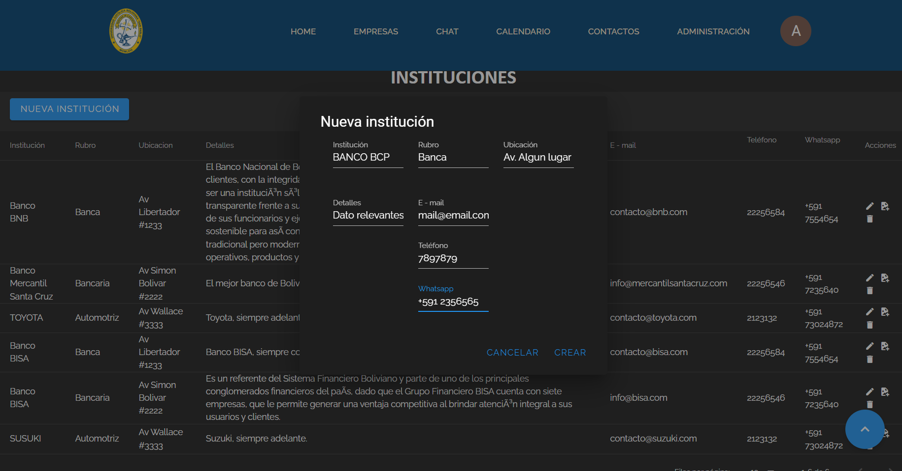
_Screenshot showing the form to create a new institution._

### Uploading Images to Firebase with Drag and Drop

Admins can upload images to Firebase by simply dragging and dropping the files. This feature makes it easy to add visual content for institutions.

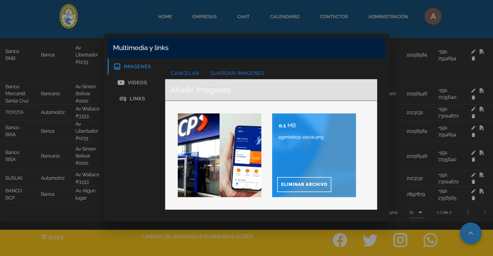
_Screenshot showing the drag and drop feature for uploading images to Firebase._

### Uploading YouTube Links to an Institution

This screen allows administrators to add YouTube links to an institution's profile. These videos can provide additional information or showcase the institution's work.

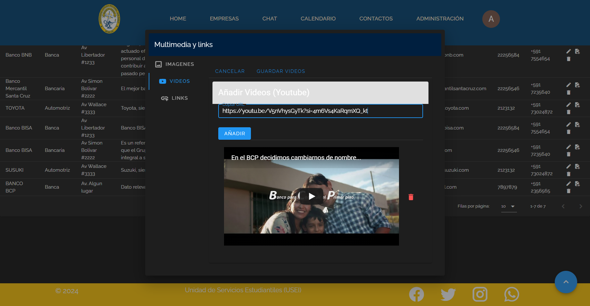
_Screenshot showing the form to add YouTube links to an institution._

### Uploading Social Networks from the Institution

Administrators can link the institution's social media accounts, making it easy for students to follow and engage with their potential employers.

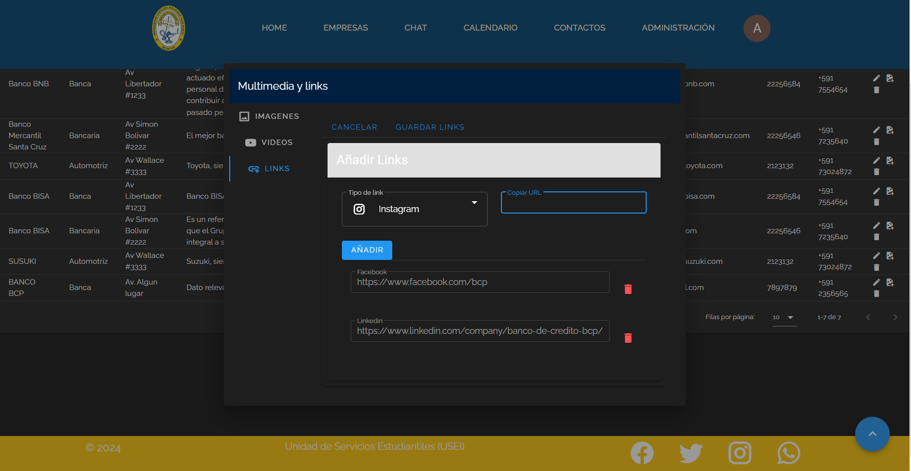
_Screenshot showing the form to add social media links for an institution._

### Create a New Charla for an Institution

This form allows administrators to create new charlas (talks) for institutions. They can set the date, time, and other relevant details, including the maximum number of participants.

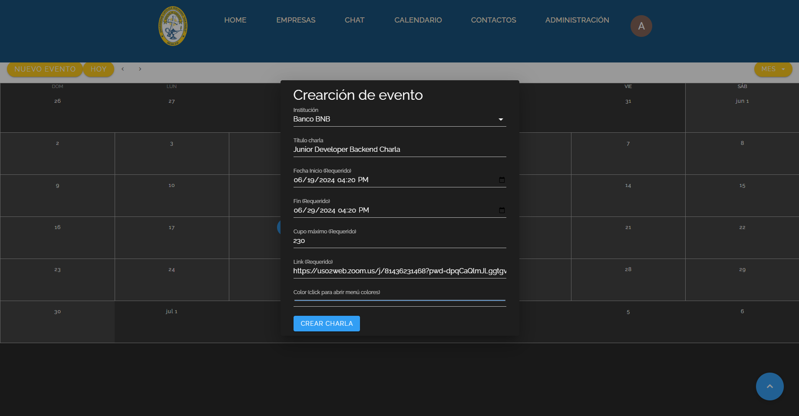
_Screenshot showing the form to create a new charla for an institution._

### Students Interested in Charlas

This screen shows a list of students who have registered interest in specific charlas. Administrators can use this to manage attendance and follow-up.

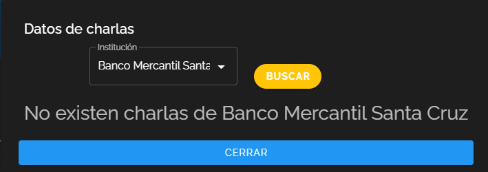
_Screenshot showing the list of students interested in charlas._

## Installation and Setup

### Database Setup

1. **Build the Docker Image**:

   The `docker build` command builds a Docker image from the Dockerfile in the `./back_end` directory and tags it as `mysql-img`.

   In the `./back_end` directory execute:

   ```bash
   docker build -t mysql-img ./
   ```

2. **Run the Docker Container**:

   The `docker run` command runs a container from the `mysql-img` image, names the container `mysql-cont`, maps port 3333 on your host to port 3306 in the container, and runs it in detached mode (`-d`).

   ```bash
   docker run -d -p 3333:3306 --name mysql-cont mysql-img
   ```

### Backend Setup

1. **Install Dependencies:**

   ```bash
   cd back_end
   npm install
   ```

2. **Start Server:**
   ```bash
   npm run dev
   ```

### Frontend Setup

1. **Install Dependencies:**

   ```bash
   cd front_end
   npm install
   ```

2. **Start Development Server:**
   ```bash
   npm run serve
   ```

## License

This project is licensed under the MIT License - see the LICENSE file for details.
